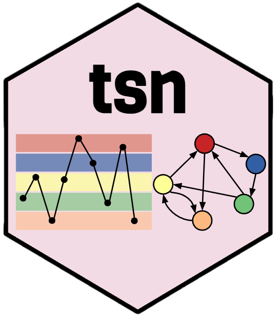

```{r setup, include = FALSE}
knitr::opts_chunk$set(
  collapse = TRUE,
  comment = "#>",
  fig.path = "man/figures/README-",
  fig.align = "center",
  fig.width = 7,
  fig.height = 4.5,
  dpi = 150,
  out.width = "100%"
)

library(tsn)
set.seed(2026)
```

# tsn 

`tsn` constructs networks from time-series data. Representing a time series
as a network exposes its temporal structure to the tools of graph theory, and
several established methods do this in different ways. What distinguishes them
is **what each node represents**; `tsn` collects them under a single interface
and a single result object.

Whatever the input, a single time series or a collection of them, the analysis
follows one of two paths that differ only in what becomes a node:

```
                        ┌─►  states ───────────────────────►  transition network
  a univariate series ──┤
  (one or several)      └─►  series, windows, or points  ──►  distance or
                             (individual observations)        visibility network
```

Two broad strategies are supported:

- **Nodes are states.** A numeric series is discretized into a small alphabet
  of states, and the network encodes how the series moves between those states
  over time. The result is a *state-transition network*.
- **Nodes are the measurements themselves**, whether a whole series, a sliding
  window, or an individual observation. Edges are then defined directly by the
  distance or the visibility relation between nodes, with no discretization
  step.

The exported functions cover both strategies:

| Task | Function(s) | Options |
|---|---|---|
| Model state transitions | `ts_tna()`, `ts_ftna()`, `ts_cna()`, `ts_atna()` | transition probabilities, frequencies, co-occurrences, or attention-weighted transitions (via Nestimate) |
| Split a pooled model by series | `series_networks()` | one network per series |
| Discretize values into states | `discretize()` (or `tsn(unit = "state")`) | 15 discretizers, applied consistently across series |
| Classify local trend direction | `trend()` | Theil–Sen (default), OLS, Spearman, or Kendall slope; growth factor |
| Build a distance or visibility network | `tsn()`, `vg()` | 15 distance measures; natural or horizontal visibility; full, nearest-neighbour, threshold, percentile, or Gaussian connectivity |

Core network construction uses base R only. Transition-network estimation is delegated to the optional `Nestimate`
package, and network rendering to `cograph` (with `igraph`); the source-series
plots require neither.

> **Related packages.** `tsn` is distinct from `tsnet` (Bayesian graphical
> vector autoregression), `tsna` (temporal social-network analysis), and
> `ts2net` (a related time-series-to-network toolkit). Its emphasis is a
> compact, dependency-light interface that supports irregularly spaced
> visibility graphs, fifteen discretizers, and an optional bridge to
> transition-network models.

## Installation

The package is not currently published on CRAN. Install the development
release from GitHub:

```r
install.packages("remotes")
remotes::install_github("mohsaqr/tsn")
```

## State-transition networks

The `ts_tna()` family constructs a transition network directly from raw
measurements: each series is discretized, a single state alphabet is shared
across all series, and the estimation is delegated to `Nestimate` (a Suggests
dependency). The four functions differ only in the quantity placed on the
edges. `ts_tna()` estimates transition probabilities, `ts_ftna()` raw
transition frequencies, `ts_cna()` co-occurrences, and `ts_atna()`
attention-weighted transitions.

The packaged `steps` dataset records daily step counts. Because participant 35
has missing days, we model the complete observations for two participants:

```{r transitions, message = FALSE}
data(steps)

complete <- subset(steps, !is.na(steps))

model <- ts_tna(
  complete,
  value = "steps",
  id = "id",
  time = "day",
  series = c(536, 88),
  n_states = 3,
  labels = c("low", "moderate", "high")
)

model
```

The transition matrix is strongly diagonal: in the pooled model a `low` day
is followed by another `low` day with probability 0.578, and a `high` day by
another `high` day with probability 0.605, so days tend to persist in their
state. Because the state alphabet is learned from both series jointly, the two
participants are placed on a common scale. `series_networks()` then splits the
pooled model into one network per series:

```{r per-series}
series_networks(model)
```

The resulting collection supports `print()`, `summary()`, `as.data.frame()`,
and `plot()` directly (`plot()` takes `series = "<name>"` when the collection
holds more than one model). The combined plot places each participant's shaded
series alongside their own transition network:

```{r transition-plot, fig.width = 9, fig.height = 5.5, fig.alt = "Two rows, one per participant: each shows the daily step series with a state ribbon strip underneath and that participant's three-state transition network beside it, with edge weights printed on the arrows."}
plot(model, ribbon = TRUE, overlay = "none")
```

Because the result is a genuine `Nestimate` model, the full range of
downstream `Nestimate` tools applies unchanged (for example
`Nestimate::net_centrality(model)`). Inferential procedures retain their usual
sampling requirements; sequence bootstrap, in particular, is not informative
for a model estimated from a single sequence.

## From values to states: `discretize()` and `trend()`

`discretize()` is the bridge from a numeric series to a state sequence. Using
the same `steps` data, participant 536 contributes 265 complete days:

```{r discretize}
states <- discretize(
  steps,
  value = "steps",
  id = "id",
  time = "day",
  series = 536,
  method = "quantile",
  n_states = 3,
  labels = c("low", "moderate", "high")
)

summary(states)
```

Fifteen discretizers are available (`threshold`, `width`, `quantile`, `kde`,
`kmeans`, `gaussian`, `hclust`, `ordinal`, `symbolic`, `change_points`,
`entropy`, `magnitude`, `adaptive_magnitude`, `percentile_magnitude`,
`dtw`). The temporal discretizers are group-aware: ordinal patterns,
adaptive-magnitude features, and DTW windows are computed separately within
each series and then mapped onto one shared state vocabulary, so that states
remain comparable across series.

`trend()` is a companion discretizer for *direction* rather than *level*: it
classifies each observation by the slope of a rolling regression.

```{r trend}
movement <- trend(
  steps,
  value = "steps",
  id = "id",
  time = "day",
  series = 536,
  window = 14
)

summary(movement)
```

## Visibility networks: observations as nodes

A visibility graph (Lacasa et al., 2008) maps a single series onto a network
of its observations: two time points are connected when an unobstructed
straight sightline over the intervening values joins them. The packaged
`motivation` dataset holds 4,871 experience-sampling measurements; the first
60 pleasure ratings suffice to illustrate the construction.

```{r visibility}
data(motivation)

pleasure <- head(motivation, 60)
network <- vg(pleasure, series = "pleasure")

summary(network)
```

The 60 observations become 60 nodes joined by 143 sightlines. Every network
offers two complementary views: `plot(x)` draws the network itself through
`cograph`, and `plot(x, "series")` shows the source series from which it was
built.

```{r visibility-network, fig.alt = "Natural visibility graph of sixty pleasure ratings, drawn as a spring-layout network with nodes sized by degree; a few high-degree hubs correspond to peak observations that see far along the series."}
plot(network)
```

```{r visibility-series, fig.height = 3, fig.alt = "The sixty pleasure ratings the visibility graph was built from, plotted as a line over observation order."}
plot(network, "series")
```

`vg(x)` builds a natural visibility graph and `vg(x, "horizontal")` a
horizontal one (Luque et al., 2009); the `tsn()` shortcuts `"nvg"` and `"hvg"`
are equivalent. Visibility options include `directed`, `penetrable`
(sightlines may cross a bounded number of points), `limit` (a maximum elapsed
time), and `decay`. When a `time` column is supplied, both the sightlines and
the elapsed-time rules respect the observed spacing between points, which may
be irregular, rather than mere row positions.

## State networks from visibility

`tsn(unit = "state")` applies the same discretization engine and then projects
the visibility graph onto the states: nodes become states, and each edge
aggregates (by default, sums) the sightlines between occurrences of a state
pair.

```{r state-network}
state_network <- tsn(
  steps,
  value = "steps",
  id = "id",
  time = "day",
  series = 536,
  unit = "state",
  discretization = "quantile",
  n_states = 3
)

summary(state_network)
```

The series view shades the states over the raw values, either as horizontal
value bands (`overlay = "horizontal"`) or as vertical runs along time:

```{r state-overlay, fig.height = 3.2, fig.alt = "Daily step counts for participant 536 with horizontal shading marking the three quantile state bands across the y-axis."}
plot(state_network, "series", overlay = "horizontal")
```

## Distance networks: series and windows as nodes

Under `method = "distance"`, nodes are whole series (or sliding windows) and
edge weights are similarities, so that larger weights indicate closer series.
Comparing five motivation variables as complete series is a single call:

```{r distance-series}
affect <- tsn(
  motivation,
  series = c("pleasure", "autonomy", "competence", "relatedness", "mood"),
  method = "distance",
  distance = "correlation"
)

summary(affect)
```

```{r distance-network, fig.height = 5, fig.alt = "Correlation-distance network of five motivation variables, drawn with labeled nodes; all ten pairs are connected and autonomy and competence form the strongest tie."}
plot(affect, labels = TRUE)
```

All ten pairs are connected because the default connectivity rule is
`connect = "full"`; autonomy and competence form the closest pair. Fifteen
distance measures are available (`euclidean`, `manhattan`, `maximum`,
`canberra`, `minkowski`, `binary`, `cosine`, `correlation`, `spearman`,
`dtw`, `ccf`, `nmi`, `voi`, `event_sync`, `van_rossum`), and `connect`
sparsifies the network by nearest neighbours, a distance threshold, a
percentile, or a Gaussian kernel.

The same function compares sliding windows of a single series, turning one
trajectory into a network of its own epochs:

```{r distance-windows}
windows <- tsn(
  pleasure,
  series = "pleasure",
  method = "distance",
  distance = "dtw",
  window = 12,
  step = 4,
  connect = "nearest",
  neighbors = 2
)

summary(windows)
```

The 60 ratings yield 13 overlapping windows; retaining each window's two
nearest neighbours keeps 17 of the 78 possible dyads. The default `window` is
10% of the series length, so `step` should be chosen relative to the series
length. Further options include `chain = TRUE` (connect only consecutive
windows or series), `directed = TRUE`, and `normalize = TRUE`.

## A single object, a consistent grammar

However it was constructed, a `tsn` network is the same kind of object: a
list-backed result carrying the `netobject` and `cograph_network` classes,
with a tidy dyad table inside. The standard methods apply throughout:

```r
summary(network)                         # one tidy row describing the network
as.data.frame(network)                   # the dyad table
as.data.frame(network, what = "series")  # the source observations
as.matrix(network)                       # the weighted adjacency matrix

plot(network)                            # network view, rendered by cograph
plot(network, "series")                  # source-series view, base graphics
```

`plot()` on a network applies readable defaults (a spring layout with
degree-scaled nodes); any `cograph` argument passes straight through and
overrides them, for example `plot(network, layout = "circle", labels = TRUE)`.

## Vignettes

- `vignette("pleasure-all-functions")` applies every exported `tsn` function
  to the packaged `motivation` pleasure series, end to end.
- `vignette("plotting-time-series-networks")` documents the plotting surface:
  the network and source-series views, state overlays, and transition-model
  plots.

## Relationships with other packages

`tsn` focuses on turning time series into networks and relies on base R alone
for that core. Two related tasks are handled by companion packages:

- **`Nestimate`** (Saqr, López-Pernas, & Misiejuk, 2026) estimates and
  analyses transition networks, following the transition-network-analysis
  framework of Saqr et al. (2025). The `ts_tna()` family discretizes the raw
  series and then calls its builders, so a `tsn` transition network is itself
  a `Nestimate` model that every `Nestimate` method applies to.
- **`cograph`** (Saqr, López-Pernas, & Tikka, 2026) provides graph conversion,
  analytics, layout, and rendering. Because every `tsn` result already carries
  the `cograph_network` class, `plot(network)` delegates to `cograph::splot()`.

Both are `Suggests`: `Nestimate` is needed only for transition networks and
`cograph` (with `igraph`) only for network plots. Everything else runs on a
base-R installation.

## References

Lacasa, L., Luque, B., Ballesteros, F., Luque, J., & Nuño, J. C. (2008). From
time series to complex networks: The visibility graph. *Proceedings of the
National Academy of Sciences*, 105(13), 4972–4975.
<https://doi.org/10.1073/pnas.0709247105>

Luque, B., Lacasa, L., Ballesteros, F., & Luque, J. (2009). Horizontal
visibility graphs: Exact results for random time series. *Physical Review E*,
80, 046103. <https://doi.org/10.1103/PhysRevE.80.046103>

Saqr, M., López-Pernas, S., Törmänen, T., Kaliisa, R., Misiejuk, K., & Tikka,
S. (2025). Transition network analysis: A novel framework for modeling,
visualizing, and identifying the temporal patterns of learners and learning.
*Proceedings of the 15th Learning Analytics and Knowledge Conference*.
<https://doi.org/10.1145/3706468.3706513>

Saqr, M., López-Pernas, S., & Misiejuk, K. (2026). *Nestimate: Network
estimation, bootstrap, and higher-order analysis*. R package version 0.8.4.
<https://github.com/mohsaqr/nestimate>

Saqr, M., López-Pernas, S., & Tikka, S. (2026). *cograph: Analysis and
visualization of complex networks*. R package version 2.4.5.
<https://github.com/sonsoleslp/cograph>

## Authors

- **Mohammed Saqr**, University of Eastern Finland · [saqr.me](https://saqr.me)
- **Sonsoles López-Pernas**, University of Eastern Finland ·
  [sonsoles.me](https://sonsoles.me)
- **Manuel J. Gómez**, University of Murcia ·
  [manueljgomez.es](https://manueljgomez.es)

## License

MIT