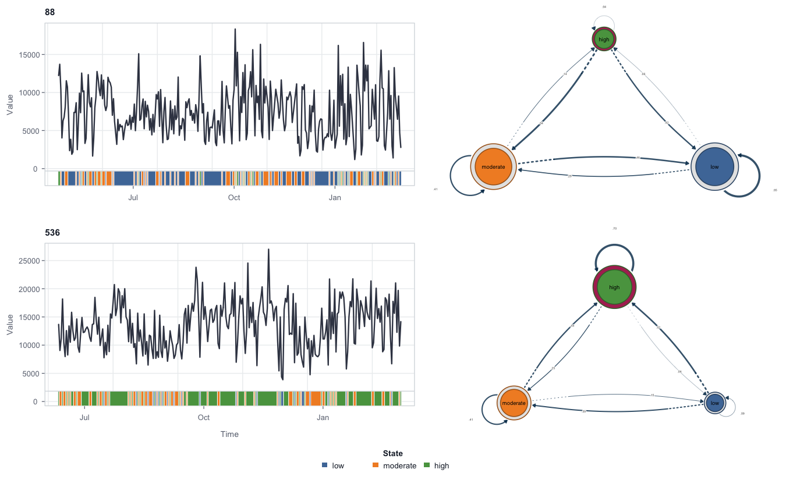
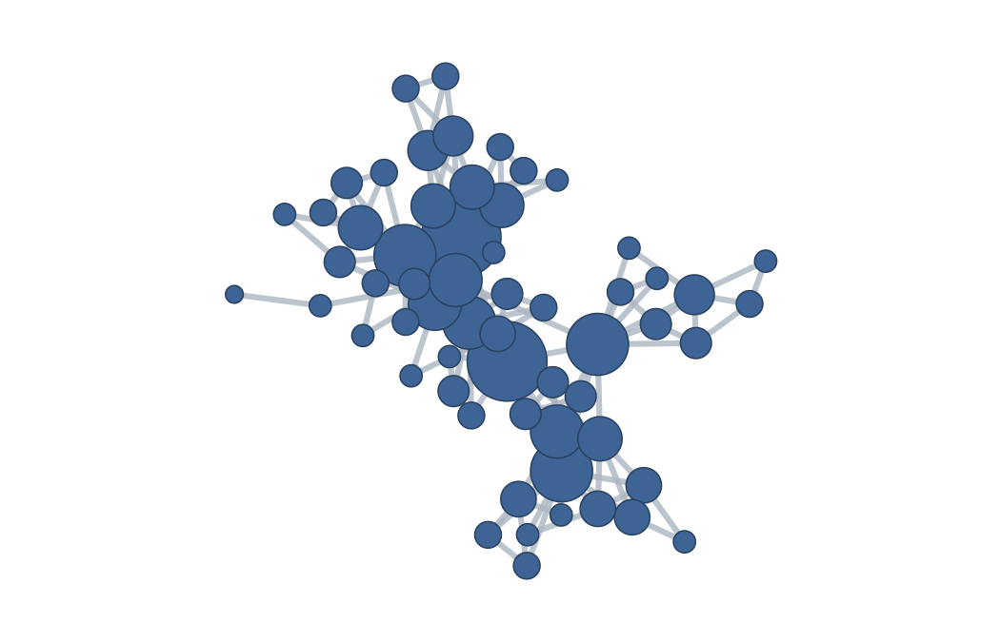
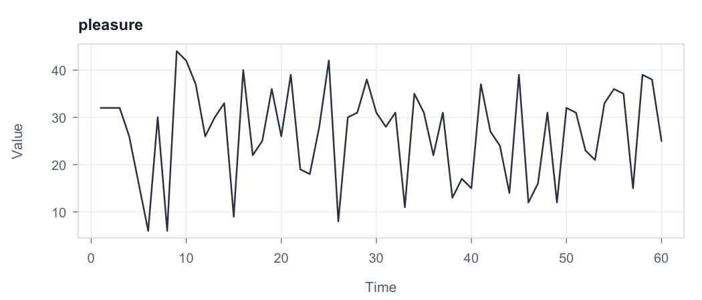
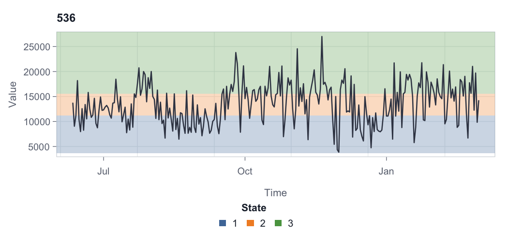
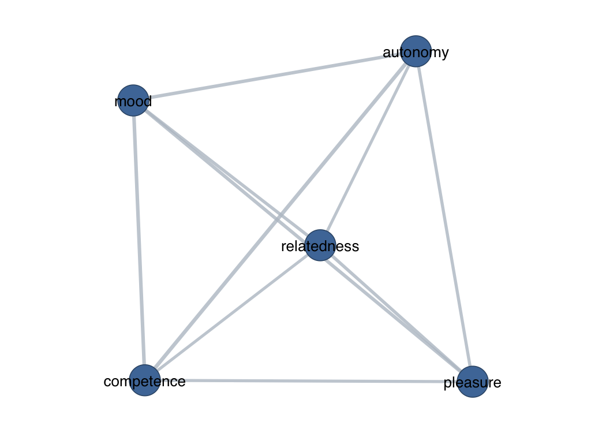

# tsn

`tsn` turns one or many time series into a network. What differs between
analyses is only **what the nodes are**:

                        ┌─► states ──────────────────► transition network
    one or many  ───────┤
    time series         └─► series, windows, or ─────► geometry network
                            observations

- **Nodes are states.** `discretize()` maps the numeric values onto a
  small state alphabet, and the network records how the series moves
  between those states over time. This is a transition network.
- **Nodes are the measurements themselves** — whole series, sliding
  windows, or individual observations. Distance or visibility between
  them supplies the edges directly, with no discretization involved.

Nine exported verbs cover both:

| What you want | Verb | Choices |
|----|----|----|
| Model state transitions | `ts_tna()`, `ts_ftna()`, `ts_cna()`, `ts_atna()` | probability, frequency, co-occurrence, or attention networks via Nestimate |
| Split a pooled model | `series_networks()` | one network per series |
| Discretize into states | `discretize()` (or `tsn(unit = "state")`) | 15 discretizers, group-safe across series |
| Classify rolling direction | `trend()` | Theil–Sen (default), OLS, Spearman, or Kendall slope; growth factor |
| Build a geometry network | `tsn()`, `vg()` | 15 distances; natural or horizontal visibility; full, nearest, threshold, percentile, or Gaussian connection |

Core construction uses base R only. `Nestimate` is an optional
dependency for the `ts_tna()` transition-network family; network plots
delegate to `cograph` (with `igraph`), while the source-series view
needs neither.

> Not to be confused with `tsnet` (Bayesian graphical VAR), `tsna`
> (temporal social networks), or `ts2net` (a related but distinct
> time-series-to-network toolkit). `tsn` emphasizes a compact,
> dependency-light R interface with irregular-time visibility support,
> fifteen discretizers, and optional transition-network integration.

## Installation

The package is not currently published on CRAN. Install the development
release from GitHub:

``` r
install.packages("remotes")
remotes::install_github("mohsaqr/tsn")
```

## Transition networks between states

The `ts_tna()` family goes from raw measurements to a transition network
in one call: it discretizes each series, keeps one shared state alphabet
across them, and delegates the estimation to `Nestimate` (a Suggests
dependency). `ts_tna()` fits transition probabilities, `ts_ftna()` raw
frequencies, `ts_cna()` co-occurrences, and `ts_atna()`
attention-weighted transitions.

The packaged `steps` data records daily step counts. Participant 35 has
missing days, so we model the complete observations for two
participants:

``` r
data(steps)

complete <- subset(steps, !is.na(steps))

model <- ts_tna(
  complete,
  value = "steps",
  id = "id",
  time = "day",
  series = c(536, 88),
  n_states = 3,
  labels = c("low", "moderate", "high")
)

model
#> Transition Network (relative probabilities) [directed]
#>   Weights: [0.108, 0.605]  |  mean: 0.333
#> 
#>   Weight matrix:
#>              low moderate  high
#>   low      0.578    0.303 0.119
#>   moderate 0.319    0.411 0.270
#>   high     0.108    0.286 0.605 
#> 
#>   Initial probabilities:
#>   high          1.000  ████████████████████████████████████████
#>   low           0.000  
#>   moderate      0.000
```

Days are sticky: in the pooled model a `low` day is followed by another
`low` day with probability 0.578, and a `high` day by another `high` day
with probability 0.605. The pooled state alphabet is learned from both
series together, so the two participants are placed on one common scale;
`series_networks()` then splits the model into per-series networks:

``` r
series_networks(model)
#>  series type observations states edges
#>      88  tna          292      3     9
#>     536  tna          265      3     9
```

The returned collection supports `print()`, `summary()`,
`as.data.frame()`, and `plot()` directly (`plot()` takes
`series = "<name>"` when the collection holds more than one model). The
combined plot stacks each participant’s shaded series next to their own
transition network:

``` r
plot(model, ribbon = TRUE, overlay = "none")
#> Registered S3 method overwritten by 'cograph':
#>   method     from     
#>   print.mcml Nestimate
```



Because the result is a Nestimate model, its downstream tools apply
unchanged (for example `Nestimate::net_centrality(model)`). Inferential
methods retain their usual sampling requirements; in particular,
sequence bootstrap is not informative for a model built from a single
sequence.

## From values to states: `discretize()` and `trend()`

`discretize()` is the bridge from numeric series to state sequences. The
packaged `steps` data records daily step counts; participant 536
contributes 265 complete days.

``` r
states <- discretize(
  steps,
  value = "steps",
  id = "id",
  time = "day",
  series = 536,
  method = "quantile",
  n_states = 3,
  labels = c("low", "moderate", "high")
)

summary(states)
#>      state count proportion mean_value
#> 1      low    88  0.3320755   8838.966
#> 2 moderate    89  0.3358491  13599.753
#> 3     high    88  0.3320755  18165.034
```

Fifteen discretizers are available (`threshold`, `width`, `quantile`,
`kde`, `kmeans`, `gaussian`, `hclust`, `ordinal`, `symbolic`,
`change_points`, `entropy`, `magnitude`, `adaptive_magnitude`,
`percentile_magnitude`, `dtw`), and the temporal ones are group-safe:
ordinal patterns, adaptive-magnitude features, and DTW windows are
computed separately within each series, then mapped to one shared state
vocabulary.

`trend()` is a companion discretizer for direction: it classifies each
observation by its rolling slope.

``` r
movement <- trend(
  steps,
  value = "steps",
  id = "id",
  time = "day",
  series = 536,
  window = 14
)

summary(movement)
#>        state count proportion
#> 1  Ascending    91  0.3433962
#> 2 Descending    80  0.3018868
#> 3  Turbulent    81  0.3056604
#> 4    Initial    13  0.0490566
```

## Visibility networks: observations as nodes

A visibility graph maps a single series onto a network of its
observations: two time points are connected when a straight sightline
over the intervening values joins them. The packaged `motivation` data
holds 4,871 experience samples; the first 60 pleasure ratings are enough
to see the idea.

``` r
data(motivation)

pleasure <- head(motivation, 60)
network <- vg(pleasure, series = "pleasure")

summary(network)
#>       method unit nodes dyads edges    density minimum_weight maximum_weight
#> 1 visibility time    60   143   143 0.08079096              1              1
#>   directed
#> 1    FALSE
```

The 60 observations become 60 nodes joined by 143 sightlines. Every
network has two plot views: `plot(x)` renders the network itself through
`cograph`, and `plot(x, "series")` shows the source series it was built
from.

``` r
plot(network)
```



``` r
plot(network, "series")
```



`vg(x)` builds a natural visibility graph and `vg(x, "horizontal")` a
horizontal one; the `tsn()` method strings `"nvg"` and `"hvg"` are sugar
for the same calls. Visibility options include `directed`, `penetrable`
(sightlines may cross a few points), `limit` (a maximum elapsed time),
and `decay`; when a `time` column is supplied, sightlines and
elapsed-time rules use the observed — possibly irregular — spacing
rather than row positions.

## State networks from visibility

`tsn(unit = "state")` runs the same discretization engine and then
collapses the visibility graph onto the states: nodes are states, and
each edge aggregates (by default, sums) the sightlines between
occurrences of a state pair.

``` r
state_network <- tsn(
  steps,
  value = "steps",
  id = "id",
  time = "day",
  series = 536,
  unit = "state",
  discretization = "quantile",
  n_states = 3
)

summary(state_network)
#>       method  unit nodes dyads edges density minimum_weight maximum_weight
#> 1 visibility state     3     6     6       1             56            258
#>   directed
#> 1    FALSE
```

The series view shades the states over the raw values, either as
horizontal value bands (`overlay = "horizontal"`) or as vertical runs
along time:

``` r
plot(state_network, "series", overlay = "horizontal")
```



## Distance networks: series and windows as nodes

With `method = "distance"`, the nodes are whole series (or sliding
windows) and edge weights are similarities: larger means closer.
Comparing five motivation variables as complete series takes one call:

``` r
affect <- tsn(
  motivation,
  series = c("pleasure", "autonomy", "competence", "relatedness", "mood"),
  method = "distance",
  distance = "correlation"
)

summary(affect)
#>     method   unit nodes dyads edges density minimum_weight maximum_weight
#> 1 distance series     5    10    10       1      0.5088532      0.6586452
#>   directed
#> 1    FALSE
```

``` r
plot(affect, labels = TRUE)
```



All ten pairs are connected because `connect = "full"` is the default;
autonomy–competence is the closest pair. Fifteen distances are available
(`euclidean`, `manhattan`, `maximum`, `canberra`, `minkowski`, `binary`,
`cosine`, `correlation`, `spearman`, `dtw`, `ccf`, `nmi`, `voi`,
`event_sync`, `van_rossum`), and `connect` sparsifies the result by
nearest neighbors, a threshold, a percentile, or a Gaussian kernel.

The same verb compares sliding windows of one series, which turns a
single trajectory into a network of its own epochs:

``` r
windows <- tsn(
  pleasure,
  series = "pleasure",
  method = "distance",
  distance = "dtw",
  window = 12,
  step = 4,
  connect = "nearest",
  neighbors = 2
)

summary(windows)
#>     method   unit nodes dyads edges   density minimum_weight maximum_weight
#> 1 distance window    13    78    17 0.2179487     0.00990099     0.02564103
#>   directed
#> 1    FALSE
```

The 60 ratings yield 13 overlapping windows, and keeping each window’s
two nearest neighbors retains 17 of the 78 possible dyads. The default
`window` is 10% of the series length, so choose `step` relative to how
long the series is. Further options include `chain = TRUE` (connect only
consecutive windows or series), `directed = TRUE`, and
`normalize = TRUE`.

## One object, one grammar

However it was built, a `tsn` network is the same kind of object: a
list-backed result carrying the `netobject`/`cograph_network` classes,
with a tidy dyad table inside. The standard verbs work everywhere:

``` r
summary(network)                         # one tidy row describing the network
as.data.frame(network)                   # the dyad table
as.data.frame(network, what = "series")  # the source observations
as.matrix(network)                       # the weighted adjacency matrix

plot(network)                            # network view, rendered by cograph
plot(network, "series")                  # source-series view, base graphics
```

`plot()` on a network applies readable defaults (spring layout,
degree-scaled nodes); any `cograph` argument passes straight through and
overrides them, for example
`plot(network, layout = "circle", labels = TRUE)`.

## Vignettes

- `vignette("pleasure-all-functions")` applies every exported tsn
  function to the packaged `motivation` pleasure series, end to end.
- `vignette("plotting-time-series-networks")` covers the plotting
  surface: the network and source-series views, state overlays, and
  transition-model plots.

## Package boundaries

`tsn` owns time-series-to-network construction and the bridge from
numeric series to state sequences. `Nestimate` owns transition-network
estimation and inference; tsn calls its builders rather than
reimplementing them. `cograph` owns generic graph conversion, analytics,
layouts, and network rendering: a `tsn` result is already a
`cograph_network`, and `plot(network)` delegates to `cograph::splot()`.
