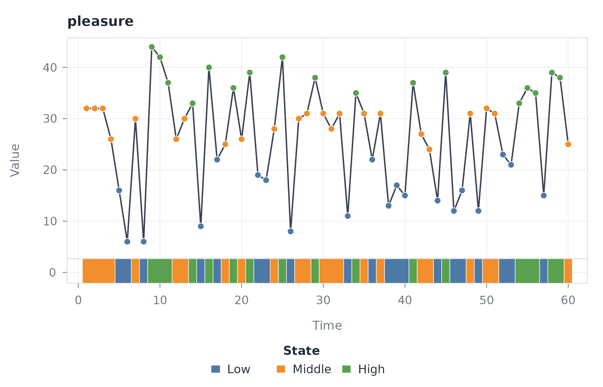
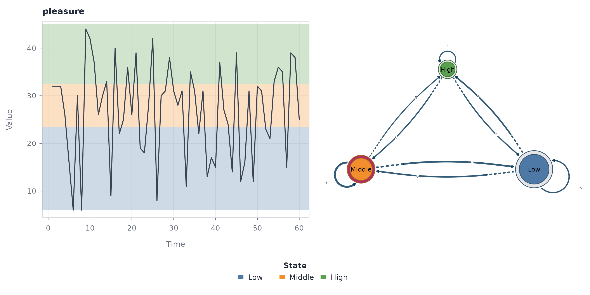
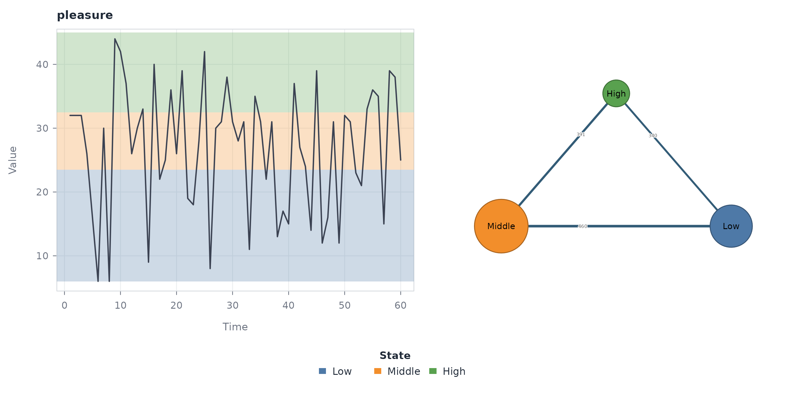
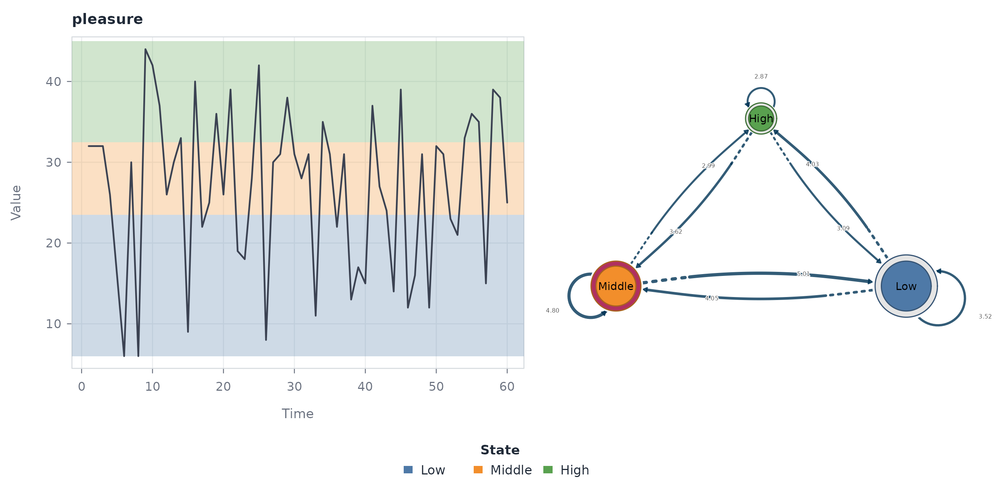
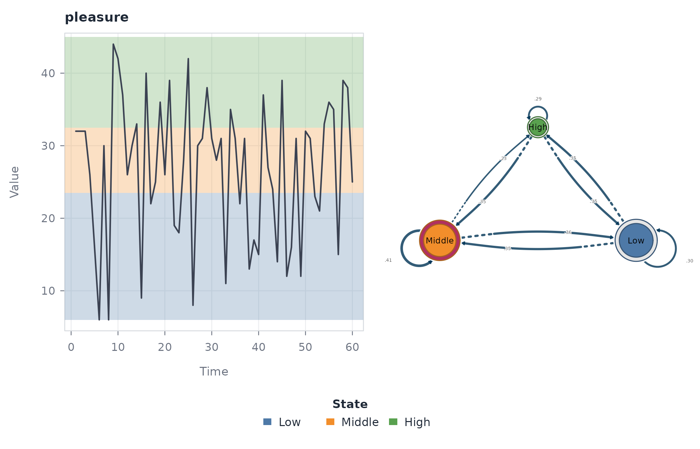
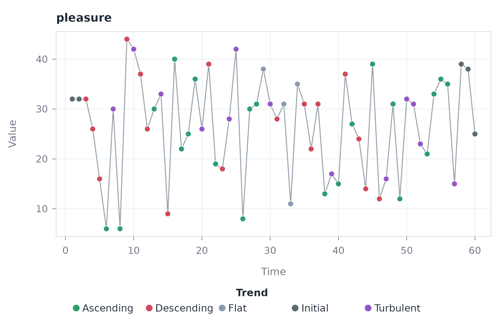
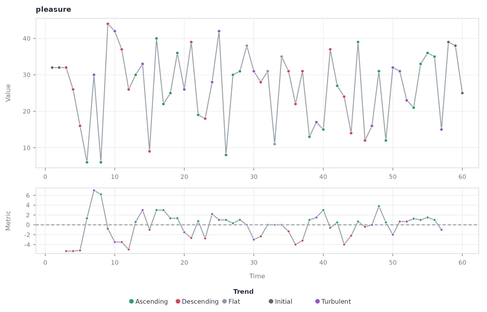
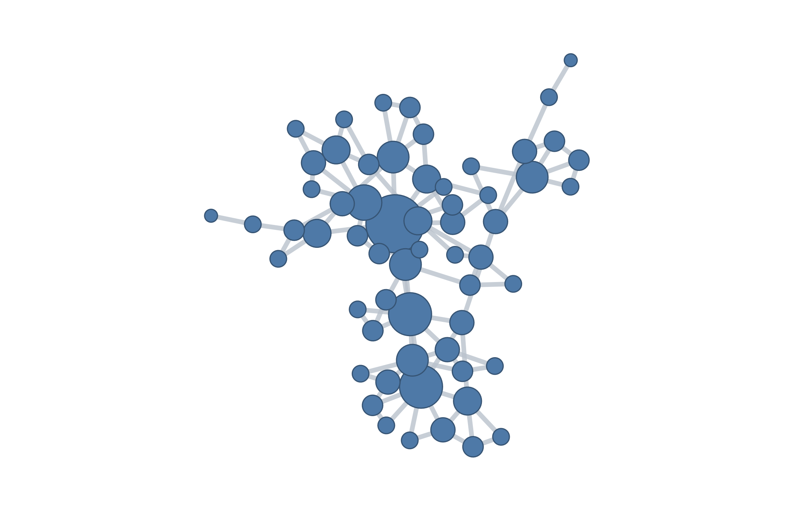
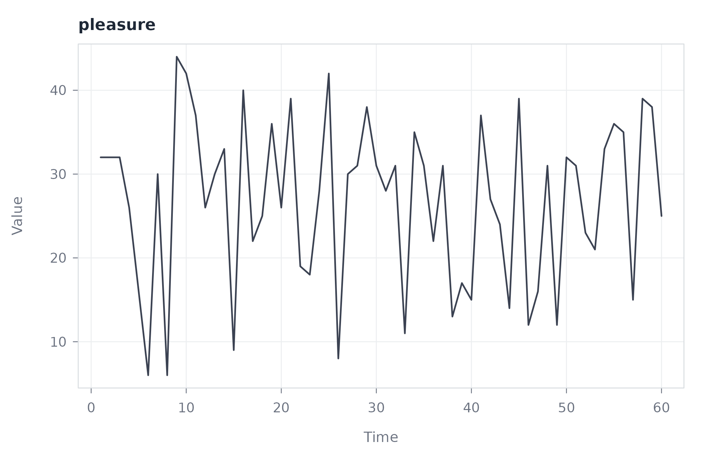
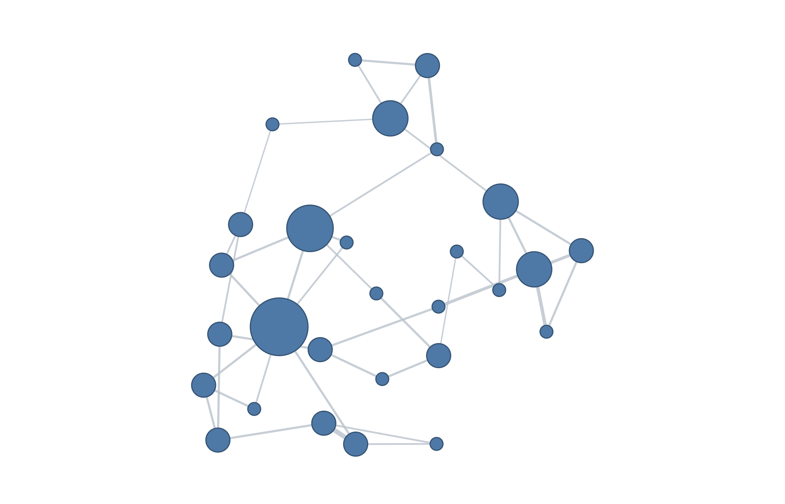

# Time Series Networks

## Introduction

Time series analysis traditionally represents temporal data through
observations indexed by time, with emphasis placed on quantities such as
level, variation, dependence, and temporal change. A network-based
representation provides a complementary perspective by replacing, or
augmenting, the explicit time index with a relational structure. In this
framework, observations, temporal states, or local windows can be
represented as nodes, while edges encode relationships defined by
geometric visibility, similarity, state transitions, co-occurrence, or
weighted dependence. The resulting network is therefore not a unique
property of a time series. It is determined by the representation used
and by the structural question that the representation is designed to
answer.

The **tsn** R package implements a collection of network representations
for time series while keeping these modelling choices explicit. The
[`discretize()`](https://pak.dynasite.org/tsn/reference/discretize.md)
function maps continuous observations to a finite set of states,
providing a symbolic representation of the series. The
[`trend()`](https://pak.dynasite.org/tsn/reference/trend.md) function
characterizes local direction and captures short-range increases,
decreases, and stable or turbulent behaviour. The
[`vg()`](https://pak.dynasite.org/tsn/reference/vg.md) function
constructs a visibility graph in which observations are connected
according to their geometric visibility. The
[`tsn()`](https://pak.dynasite.org/tsn/reference/tsn.md) function
constructs distance networks over complete series, local windows, or
individual observations. This vignette uses local windows and connects
them according to their similarity.

Once a time series has been represented as a sequence of discrete
states, its temporal dynamics can be studied through Transition Network
Analysis (TNA). The
[`ts_tna()`](https://pak.dynasite.org/tsn/reference/ts_tna.md) function
constructs a Transition Network (TNA). The
[`ts_ftna()`](https://pak.dynasite.org/tsn/reference/ts_tna.md) function
constructs a Frequency Transition Network (FTNA),
[`ts_cna()`](https://pak.dynasite.org/tsn/reference/ts_tna.md)
constructs a Co-occurrence Network (CNA), and
[`ts_atna()`](https://pak.dynasite.org/tsn/reference/ts_tna.md)
constructs an Attention-Weighted Transition Network (ATNA). These
constructions emphasize different properties of the same symbolic
sequence and should be interpreted as complementary rather than
interchangeable models.

The package also provides
[`series_networks()`](https://pak.dynasite.org/tsn/reference/series_networks.md)
for extracting and organizing the network model associated with each
source series. The function retains the model type, shared state
alphabet, provenance, and source index. In this single-series vignette,
it returns one indexed model and provides a direct way to print,
summarize, or plot that model.

This vignette develops every representation using one unchanged segment
of one measured variable. The examples show how each function is called
and how the resulting structure can be interpreted. Network figures are
generated through the package’s
[`plot()`](https://rdrr.io/r/graphics/plot.default.html) methods using
cograph. The four transition-network constructors require the Nestimate
package.

The functions and their returned representations are:

| Scientific question | Function | Result | What it captures |
|----|----|----|----|
| **How can the continuous series be represented as a sequence of discrete states?** | [`discretize()`](https://pak.dynasite.org/tsn/reference/discretize.md) | Tidy state table | Converts continuous observations into a finite state representation, making recurring levels, ranges, or regimes explicit. |
| **How does the series change locally over time?** | [`trend()`](https://pak.dynasite.org/tsn/reference/trend.md) | Tidy trend table | Captures local directional behaviour, distinguishing periods of increase, decrease, stability, or turbulence. |
| **Which observations are connected by geometric visibility?** | [`vg()`](https://pak.dynasite.org/tsn/reference/vg.md) | Visibility network | Captures the geometric organization of the series by connecting observations according to their visibility relationships. |
| **Which time windows show similar values or patterns?** | [`tsn()`](https://pak.dynasite.org/tsn/reference/tsn.md) | Distance network | Represents relationships among local windows according to their proximity or similarity, revealing repeated or structurally similar temporal patterns. |
| **How likely is one state to transition to another?** | [`ts_tna()`](https://pak.dynasite.org/tsn/reference/ts_tna.md) | Transition Network (TNA) | Weights directed edges between states by the conditional probability of each successive transition. |
| **How frequently does the series transition from one state to another?** | [`ts_ftna()`](https://pak.dynasite.org/tsn/reference/ts_tna.md) | Frequency Transition Network (FTNA) | Weights directed edges between states by the observed frequency of each successive transition. |
| **Which states are connected through co-occurrence in the sequence?** | [`ts_cna()`](https://pak.dynasite.org/tsn/reference/ts_tna.md) | Co-occurrence Network (CNA) | Uses undirected edges to represent state co-occurrence within the sequence. |
| **Which transitions receive greater attention weight?** | [`ts_atna()`](https://pak.dynasite.org/tsn/reference/ts_tna.md) | Attention-Weighted Transition Network (ATNA) | Weights directed edges between states by their attention values. |
| **How are network representations associated with their source series?** | [`series_networks()`](https://pak.dynasite.org/tsn/reference/series_networks.md) | Indexed model collection | Organizes extracted network models by source series while preserving their correspondence and provenance. |

The conceptual distinction is therefore clear.
[`discretize()`](https://pak.dynasite.org/tsn/reference/discretize.md)
defines the **states**,
[`trend()`](https://pak.dynasite.org/tsn/reference/trend.md) describes
**local direction**,
[`vg()`](https://pak.dynasite.org/tsn/reference/vg.md) describes
**geometric visibility**, and
[`tsn()`](https://pak.dynasite.org/tsn/reference/tsn.md) describes
**similarity between temporal windows**. The
[`ts_tna()`](https://pak.dynasite.org/tsn/reference/ts_tna.md) family
constructs transition-network representations from the resulting
sequence, differing in the information assigned to their edges.
[`series_networks()`](https://pak.dynasite.org/tsn/reference/series_networks.md)
organizes the extracted models by source series.

## Data

The `motivation` data set contains 4,871 intensive longitudinal
observations. The analysis uses the first 60 rows and selects the
`pleasure` measurement inside each tsn verb. Keeping the data as a data
frame avoids manual column extraction and preserves its original row
order.

``` r

data("motivation", package = "tsn")

pleasure <- head(motivation, 60)

dim(pleasure)
#> [1] 60 13
```

The selected ratings range from 6 to 44. Their mean is 26.8 and their
median is 30. The first twenty observations average 27.5 and the final
twenty average 27.0, so this short segment carries no pronounced drift.
The later plots should therefore be read as short-run fluctuation around
a roughly stable level rather than as a trending series.

## Transition Network Analysis

Transition network analysis begins by transforming the observed time
series into a finite sequence of states. The purpose of this
transformation is not to replace the measured values, but to provide a
symbolic representation in which temporal dynamics can be examined as
transitions among a defined set of states.
[`discretize()`](https://pak.dynasite.org/tsn/reference/discretize.md)
performs this transformation by assigning each observation to a state
and returning one tidy row per observation.

For this example, the default quantile-based discretization divides the
observed values into three empirical groups. The state labels are
supplied as `Low`, `Middle`, and `High`. Thus, the resulting sequence
preserves the temporal ordering of the observations while replacing
their continuous values with categorical states.

``` r

states <- discretize(
  data = pleasure,
  series = "pleasure",
  labels = c("Low", "Middle", "High")
)

states
#> <tsn_states> quantile discretization (transform: none): 60 observations, 3 states
#>        id time value  state probability
#>  pleasure    1    32 Middle           1
#>  pleasure    2    32 Middle           1
#>  pleasure    3    32 Middle           1
#>  pleasure    4    26 Middle           1
#>  pleasure    5    16    Low           1
#>  pleasure    6     6    Low           1
#>  pleasure    7    30 Middle           1
#>  pleasure    8     6    Low           1
#>  pleasure    9    44   High           1
#>  pleasure   10    42   High           1
summary(states)
#>    state count proportion mean_value
#> 1    Low    20  0.3333333   14.75000
#> 2 Middle    23  0.3833333   29.13043
#> 3   High    17  0.2833333   37.82353
```

The resulting object retains the source identifier, time index, observed
value, assigned state, and assignment probability. The state labels are
ordered according to the corresponding values, so `Low`, `Middle`, and
`High` retain their ordinal interpretation. Because the discretization
is based on empirical quantiles, ties at the boundaries can prevent the
three categories from containing exactly the same number of
observations. Here, the resulting state frequencies are 20 `Low`, 23
`Middle`, and 17 `High`.

The state sequence is the intermediate representation from which the
transition networks are constructed. The three states define the network
nodes, while successive observations in the sequence define the possible
state-to-state transitions. The different transition-network
constructors applied below use this same state sequence; what changes is
the quantity used to represent the relationships between states.

``` r

plot(states, type = "ribbon")
```



The ribbon representation displays the state sequence beneath the
measured series. This preserves the temporal correspondence between the
original observations and their discrete representation without
obscuring the measured values with a full-panel categorical overlay.

### Transition Network with `ts_tna()`

[`ts_tna()`](https://pak.dynasite.org/tsn/reference/ts_tna.md)
constructs a transition network from the discrete state sequence in
which directed edges represent transitions from the current state to the
subsequent state. Edge weights are conditional transition probabilities.
For a given source state, the outgoing edge weights therefore describe
the distribution of possible next states.

``` r

probabilities <- ts_tna(states)

probabilities
#> Transition Network (relative probabilities) [directed]
#>   Weights: [0.227, 0.409]  |  mean: 0.333
#> 
#>   Weight matrix:
#>            Low Middle  High
#>   Low    0.300  0.350 0.350
#>   Middle 0.364  0.409 0.227
#>   High   0.353  0.353 0.294 
#> 
#>   Initial probabilities:
#>   Middle        1.000  ████████████████████████████████████████
#>   Low           0.000  
#>   High          0.000
```

The diagonal entries quantify persistence, that is, the probability that
the next observation remains in the current state. In this example, the
self-transition probabilities are 0.300 for `Low`, 0.409 for `Middle`,
and 0.294 for `High`. Each exceeds the corresponding marginal state
proportion, indicating that consecutive observations are more likely to
remain in the same state than the marginal frequencies alone would
imply.

``` r

plot(probabilities)
```


Row normalization is central to the interpretation of this
representation. Each row describes the conditional distribution of the
next state given the current state, making outgoing transition patterns
directly comparable even when the states have different marginal
frequencies.

The combined representation links the original state sequence to the
resulting transition network. A sequence of 60 observations is therefore
reduced to three state nodes and the directed relationships connecting
them, while the temporal ordering remains the basis for estimating those
relationships.

### Frequency Transition Network (FTNA) with `ts_ftna()`

[`ts_ftna()`](https://pak.dynasite.org/tsn/reference/ts_tna.md)
constructs a transition network using the observed frequency of each
state-to-state transition. Unlike
[`ts_tna()`](https://pak.dynasite.org/tsn/reference/ts_tna.md), the edge
weights are not normalized by the number of transitions originating from
each state. The resulting network therefore retains information about
the absolute frequency with which transitions occur.

``` r

counts <- ts_ftna(states)

counts
#> Transition Network (frequency counts) [directed]
#>   Weights: [5.000, 9.000]  |  mean: 6.556
#> 
#>   Weight matrix:
#>          Low Middle High
#>   Low      6      7    7
#>   Middle   8      9    5
#>   High     6      6    5 
#> 
#>   Initial probabilities:
#>   Middle        1.000  ████████████████████████████████████████
#>   Low           0.000  
#>   High          0.000
```

With 60 observations, there are 59 adjacent observation pairs and
consequently 59 observed transitions. The transition-count matrix
therefore sums to 59. The diagonal entries are the largest entries in
each row, indicating that remaining in the current state occurs more
frequently than transitioning to either of the alternative states.

The frequency network and the probability network describe the same
underlying transitions but answer different questions. The frequency
network measures **how often** each transition occurred, whereas the
probability network measures **how likely** each transition is
conditional on the current state.

``` r

plot(counts)
```



### Co-occurrence Transition Network with `ts_cna()`

[`ts_cna()`](https://pak.dynasite.org/tsn/reference/ts_tna.md)
constructs a transition network based on the co-occurrence of states
within the transition sequence. Unlike the directed transition
representation produced by
[`ts_tna()`](https://pak.dynasite.org/tsn/reference/ts_tna.md) and
[`ts_ftna()`](https://pak.dynasite.org/tsn/reference/ts_tna.md), the
resulting network is undirected and symmetric. It therefore describes
the strength of association between states without distinguishing the
direction in which the states occur.

``` r

cooccurrence <- ts_cna(states)

cooccurrence
#> Co-occurrence Network [undirected]
#>   Weights: [136.000, 460.000]  |  mean: 295.000
#> 
#>   Weight matrix:
#>          Low Middle High
#>   Low    190    460  340
#>   Middle 460    253  391
#>   High   340    391  136
```

For a single state sequence, these co-occurrence counts are determined
by the marginal state frequencies. For example, the `Low`–`Middle`
relationship is `20 × 23 = 460`, whereas the `Low`–`Low` diagonal is
`20 × 19 / 2 = 190`. The resulting network consequently captures the
association implied by state composition rather than the temporal
direction of successive transitions.

This distinction is important when interpreting the network. A strong
edge in the co-occurrence representation does not indicate that one
state tends to follow another. It indicates that the two states occur
together within the defined co-occurrence structure.

``` r

plot(cooccurrence)
```



The symmetric network representation makes this distinction visually
explicit: unlike the directed transition networks, there is no
source-to-target direction associated with an edge.

### Attention-Weighted Transition Network (ATNA) with `ts_atna()`

[`ts_atna()`](https://pak.dynasite.org/tsn/reference/ts_tna.md)
constructs a transition network in which transitions are assigned
attention weights rather than being represented solely by their raw
frequencies or normalized probabilities. The resulting edge weights are
accumulated attention values and therefore should not be interpreted as
either transition counts or probabilities.

``` r

attention <- ts_atna(states)

attention
#> Attention Network (decay-weighted transitions) [directed]
#>   Weights: [2.875, 5.015]  |  mean: 3.778
#> 
#>   Weight matrix:
#>            Low Middle  High
#>   Low    3.524  4.055 4.031
#>   Middle 5.015  4.801 2.988
#>   High   3.085  3.625 2.875 
#> 
#>   Initial probabilities:
#>   Middle        1.000  ████████████████████████████████████████
#>   Low           0.000  
#>   High          0.000
```

The resulting weights range from 2.875 to 5.015. As in the frequency and
probability networks, the diagonal entries are the largest outgoing
relationships for all three states, indicating that persistence remains
prominent under the attention-weighted representation.

The important distinction is that the edge magnitude now reflects the
attention assigned to a transition by the model rather than simply the
number of times the transition was observed. Consequently, attention
weights should be interpreted according to the weighting mechanism of
the [`ts_atna()`](https://pak.dynasite.org/tsn/reference/ts_tna.md)
model rather than on the scale of the frequency or probability networks.

``` r

plot(attention)
```



### Extracting the Network Model with `series_networks()`

[`series_networks()`](https://pak.dynasite.org/tsn/reference/series_networks.md)
provides an indexed collection of the network models associated with the
source series. It is intended for situations in which network
representations are extracted systematically across multiple series. The
index preserves the relationship between each source series and its
corresponding network model.

In this example, only one source series is supplied, so the resulting
collection contains a single entry corresponding to `pleasure`.

``` r

individual <- series_networks(probabilities)

individual
#>    series type observations states edges
#>  pleasure  tna           60      3     9
```

The resulting index records the source series, network type, number of
observations, number of states, and number of edges. For the
transition-probability network, the three states generate nine possible
directed state-to-state relationships, including the three
self-transitions.

``` r

plot(individual)
```



The resulting model collection therefore provides a higher-level
representation of the extracted networks while retaining their
provenance. With multiple source series, the same structure can be used
to organize and compare the corresponding network models systematically.

## Local direction with `trend()`

[`trend()`](https://pak.dynasite.org/tsn/reference/trend.md) estimates a
rolling local direction and labels each observation as Ascending,
Descending, Flat, Turbulent, Missing Data, or Initial. Its adaptive
window is 6 observations for this segment. The default Theil-Sen slope
limits the influence of isolated extreme ratings.

``` r

directions <- trend(
  data = pleasure,
  series = "pleasure"
)

directions
#> <tsn_trend> slope (robust), window 6: 60 observations across 1 series
#>        id time value    metric      state
#>  pleasure    1    32        NA    Initial
#>  pleasure    2    32        NA    Initial
#>  pleasure    3    32 -5.333333 Descending
#>  pleasure    4    26 -5.333333 Descending
#>  pleasure    5    16 -5.200000 Descending
#>  pleasure    6     6  1.333333  Ascending
#>  pleasure    7    30  7.000000  Turbulent
#>  pleasure    8     6  6.200000  Ascending
#>  pleasure    9    44 -0.800000 Descending
#>  pleasure   10    42 -3.500000  Turbulent
summary(directions)
#>        state count proportion
#> 1  Ascending    21 0.35000000
#> 2 Descending    17 0.28333333
#> 3       Flat     4 0.06666667
#> 4  Turbulent    13 0.21666667
#> 5    Initial     5 0.08333333
```

Ascending is the most frequent class, with 21 observations. Descending
covers 17 observations, Turbulent 13, Initial 5, and Flat 4. Ascending
and descending positions are close in number, which is what a segment
without pronounced drift should produce: local direction keeps reversing
rather than accumulating. Initial marks positions without a complete
centered rolling window.

``` r

plot(directions)
```



The default plot colours each observation by its trend class.

``` r

plot(directions, type = "panels")
```



The panel view places the rolling metric below the measurements.
Crossings of the flat band can therefore be checked against the assigned
direction.

## Visibility with `vg()`

[`vg()`](https://pak.dynasite.org/tsn/reference/vg.md) makes each
observation a node. Natural visibility connects two points when the line
between their values passes above every intervening point. Horizontal
visibility connects them when every intervening value is below both
endpoints.

``` r

natural <- vg(
  data = pleasure,
  series = "pleasure"
)

summary(natural)
#>       method unit nodes dyads edges    density minimum_weight maximum_weight
#> 1 visibility time    60   143   143 0.08079096              1              1
#>   directed
#> 1    FALSE
```

The natural visibility graph contains 60 nodes and 143 edges.

``` r

horizontal <- vg(
  data = pleasure,
  type = "horizontal",
  series = "pleasure"
)

summary(horizontal)
#>       method unit nodes dyads edges    density minimum_weight maximum_weight
#> 1 visibility time    60   107   107 0.06045198              1              1
#>   directed
#> 1    FALSE
```

The stricter horizontal rule retains 107 edges. Both constructions have
binary edge weights because visibility either holds or does not hold.

At this length the graph is small enough for individual edges to stay
distinguishable, so the horizontal construction can be drawn directly.

``` r

plot(horizontal)
```



The temporal chain remains visible together with longer edges that cross
lower intervening observations. Node size represents degree. Peaks tend
to have more connections because they remain visible across smaller
values.

``` r

plot(horizontal, type = "series")
```



The source-series view retains the measurements behind the network
object. It also makes the short-run fluctuation that the visibility rule
reads visible.

## Window similarity with `tsn()`

[`tsn()`](https://pak.dynasite.org/tsn/reference/tsn.md) is the general
constructor. With `method = "distance"`, one measured series defaults to
sliding-window nodes. The window width defaults to one tenth of the
series length and is therefore 6 here. A step of 2 produces 28
overlapping windows.

``` r

windows <- tsn(
  data = pleasure,
  method = "distance",
  series = "pleasure",
  step = 2
)

summary(windows)
#>     method   unit nodes dyads edges density minimum_weight maximum_weight
#> 1 distance window    28   378   378       1     0.01682183      0.1118912
#>   directed
#> 1    FALSE
```

The default full connection rule evaluates and retains all 378 window
pairs. Edge weight is `1 / (1 + distance)`, so larger weights identify
more similar windows.

``` r

sparse <- tsn(
  data = pleasure,
  method = "distance",
  series = "pleasure",
  step = 2,
  connect = "nearest",
  neighbors = 2
)

summary(sparse)
#>     method   unit nodes dyads edges   density minimum_weight maximum_weight
#> 1 distance window    28   378    40 0.1058201     0.03137678      0.1118912
#>   directed
#> 1    FALSE
```

Nearest-neighbour sparsification retains 40 edges and reduces density
from 1 to 0.106. This version exposes the strongest local similarity
structure instead of drawing every possible pair.

``` r

plot(sparse)
```



No retained edge joins immediately adjacent windows. The closest
retained pairs are two positions apart and the most distant are
separated by 21 positions, showing that overlap in time does not by
itself determine Euclidean similarity.
