# Plotting Time Series Networks

## Introduction

A plot of a time series network determines which aspect of the data is
shown: the measured temporal sequence, the states assigned to
observations, or the relational structure defined by the network. These
views describe different aspects of the same analysis and should not be
interpreted as equivalent representations.

The plotting methods in **tsn** select the representation with the
`type` argument. Additional arguments control the visual encoding within
that representation, including state placement, point display, colour,
labels, node size, and edge annotation. When `type` is omitted,
[`plot()`](https://rdrr.io/r/graphics/plot.default.html) uses the
default type for the corresponding result class.

This vignette uses one `pleasure` series throughout. Each analytical
object is constructed immediately before its first plot, keeping the
relationship between the analysis and its graphical representation
explicit.

| Result class | Plot types | Default |
|----|----|----|
| Discrete states from [`discretize()`](https://pak.dynasite.org/tsn/reference/discretize.md) | `"overlay"`, `"ribbon"`, `"heatmap"`, `"stack"` | `"overlay"` |
| Local direction from [`trend()`](https://pak.dynasite.org/tsn/reference/trend.md) | `"points"`, `"ribbon"`, `"heatmap"`, `"panels"` | `"points"` |
| Network from [`tsn()`](https://pak.dynasite.org/tsn/reference/tsn.md) or [`vg()`](https://pak.dynasite.org/tsn/reference/vg.md) | `"network"`, `"series"` | `"network"` |
| TNA-family model | `"combined"`, `"network"`, `"series"` | `"combined"` |
| Model collection from [`series_networks()`](https://pak.dynasite.org/tsn/reference/series_networks.md) | `"network"` | `"network"` |

For network objects, `"network"` displays the nodes and edges defined by
the model, whereas `"series"` places the network structure in relation
to the original time series. For TNA-family models, `"combined"`
displays the state sequence together with the corresponding transition
network, while `"network"` focuses on the state-to-state relationships
alone. The choice of plot type therefore determines whether the figure
is used to examine the temporal sequence, the state representation, or
the network structure.

## Data

The examples use the first 60 observations of `pleasure` from the
`motivation` data. A 25-observation segment is used for visibility
analysis so that individual nodes and edges remain distinguishable.

``` r

data("motivation", package = "tsn")

pleasure <- head(motivation, 60)
short <- head(pleasure, 25)
```

## Discrete-state plots

The [`plot()`](https://rdrr.io/r/graphics/plot.default.html) method for
a `tsn_states` object provides four representations of the same
discretization.

| `type` | Graphical encoding | Scientific use |
|----|----|----|
| `"overlay"` | State value bands behind the measured series | Relating assigned states to their value ranges and boundaries |
| `"ribbon"` | State strip beneath an unobscured series | Retaining exact variation when state changes are frequent |
| `"heatmap"` | One categorical tile per observation | Displaying the state sequence as a compact temporal signature |
| `"stack"` | Companion series aligned above the discretized series | Relating the states of a derived quantity to its source measurement |

The principal arguments are `type` and `series`. For overlays, `overlay`
selects horizontal ranges (the default), vertical regions, or no
shading; `lines` can add state boundaries; and `min_run` suppresses very
short displayed runs without changing the fitted states. The arguments
`points`, `palette`, `alpha`, `legend`, and `grid` control graphical
appearance. Heatmaps additionally accept `sort` and `border`. The stack
view requires a numeric companion supplied with `with`; `shade` and
`color_line` determine how the state classification is carried across
the two panels.

### Overlay

The series is first discretized into three empirical quantile states and
then plotted. Because `"overlay"` is the default type, no plotting
argument is required.

``` r

states <- discretize(
  data = pleasure,
  series = "pleasure",
  labels = c("Low", "Middle", "High")
)

plot(states)
```

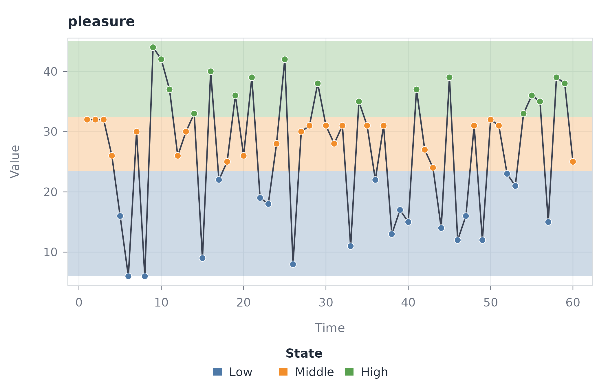

The horizontal bands identify the value ranges associated with the three
states, while the line retains the measured observations. This view
emphasizes the relationship between state membership, magnitude, and the
fitted boundaries.

### Ribbon

``` r

plot(states, "ribbon")
```

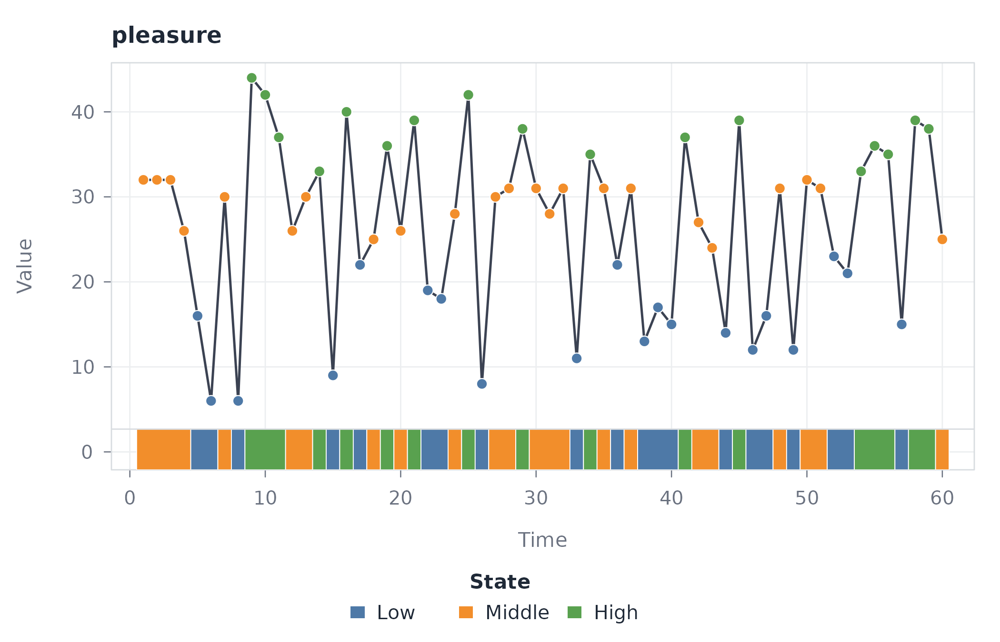

The ribbon places the state encoding outside the measurement panel. It
is preferable when vertical shading would conceal short-range variation.

### Heatmap

``` r

plot(states, "heatmap")
```

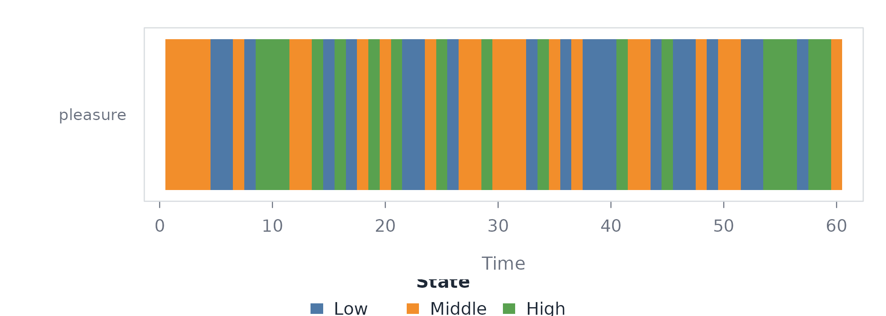

Each tile represents one time point and its colour represents the
assigned state. For one series, the result is a compact categorical
timeline.

### Stack

The stack view is appropriate when states are defined from a
transformation of the measured series. Here, one-step changes are
discretized and plotted beneath the original observations.

``` r

changes <- with(pleasure, c(0, diff(pleasure)))

change_states <- discretize(
  data = changes,
  labels = c("Negative", "Stable", "Positive")
)

plot(
  change_states,
  "stack",
  with = with(pleasure, pleasure),
  with_label = "Pleasure"
)
```

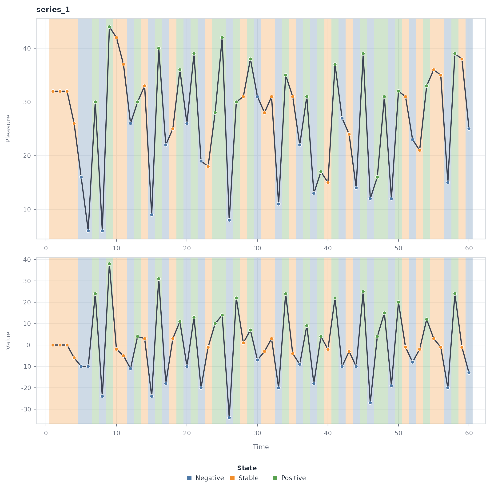

The shared time axis permits changes in the original measurement to be
read directly against their categorical representation.

## Local-direction plots

The [`plot()`](https://rdrr.io/r/graphics/plot.default.html) method for
a `tsn_trend` object provides four views of the rolling direction
classification.

| `type` | Graphical encoding | Scientific use |
|----|----|----|
| `"points"` | Observations coloured by direction | Locating ascending, descending, flat, and turbulent intervals |
| `"ribbon"` | Direction strip beneath the measured series | Separating classification from measurement variation |
| `"heatmap"` | Categorical direction tiles | Summarizing the timing of local direction |
| `"panels"` | Measured series above the rolling trend metric | Diagnosing how the numerical metric produces the classification |

The common arguments `series`, `palette`, `legend`, and `grid` control
selection and presentation. The line and point encodings are modified
with `line_color`, `line_width`, and `point_size`. In the panel view,
`flat_band` controls whether the classification threshold is shown.
Heatmap presentation can be modified with `sort` and `border`.

### Points

The local-direction model is fitted and immediately plotted using its
default point representation.

``` r

directions <- trend(
  data = pleasure,
  series = "pleasure"
)

plot(directions)
```

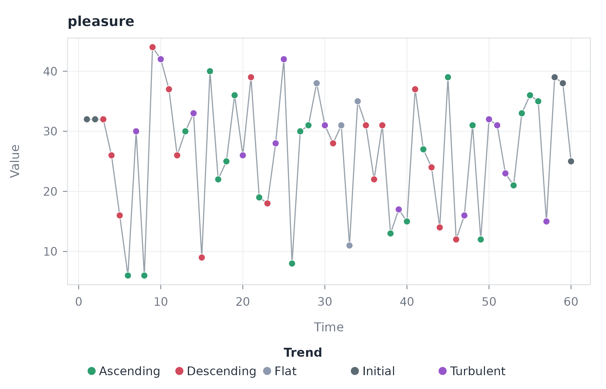

Colour encodes the local trend state at each observation. The view
retains individual measurements and is therefore suited to locating
directional changes precisely in time.

### Ribbon

``` r

plot(directions, "ribbon")
```

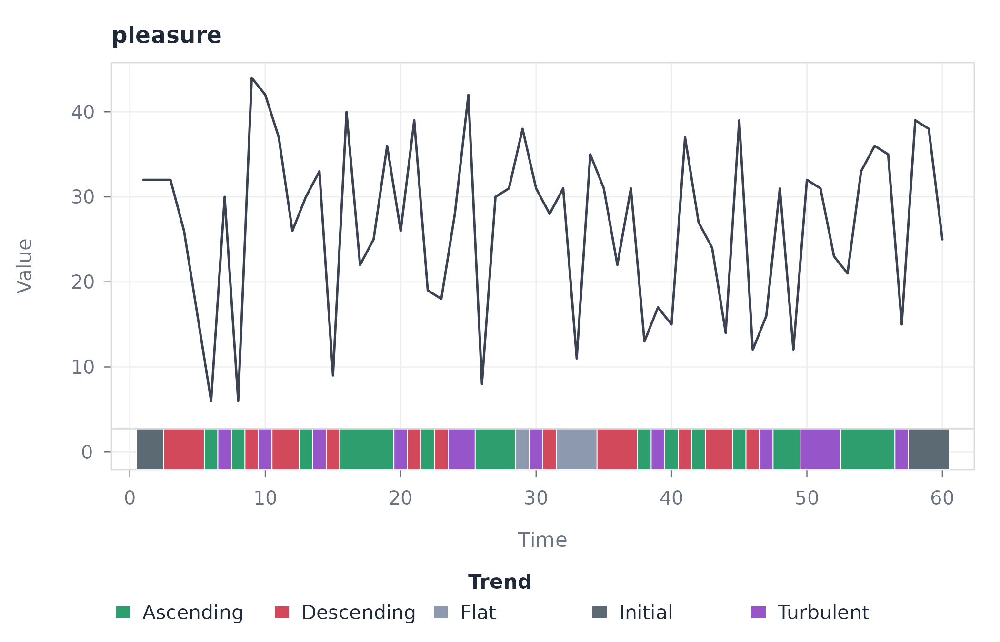

The ribbon is useful when adjacent classifications change frequently,
because the measured line remains visually continuous.

### Heatmap

``` r

plot(directions, "heatmap")
```

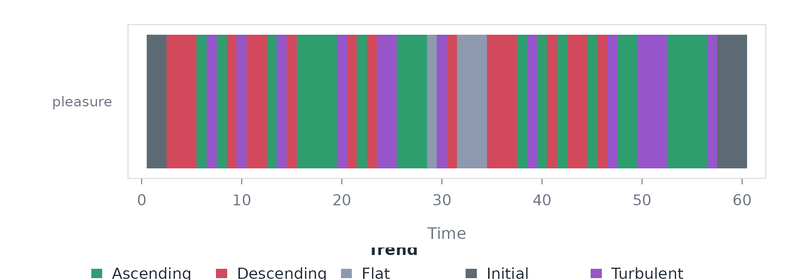

The heatmap removes magnitude and preserves only temporal
classification. It should therefore be interpreted as a map of
direction, not as a plot of the observed values.

### Panels

``` r

plot(directions, "panels")
```

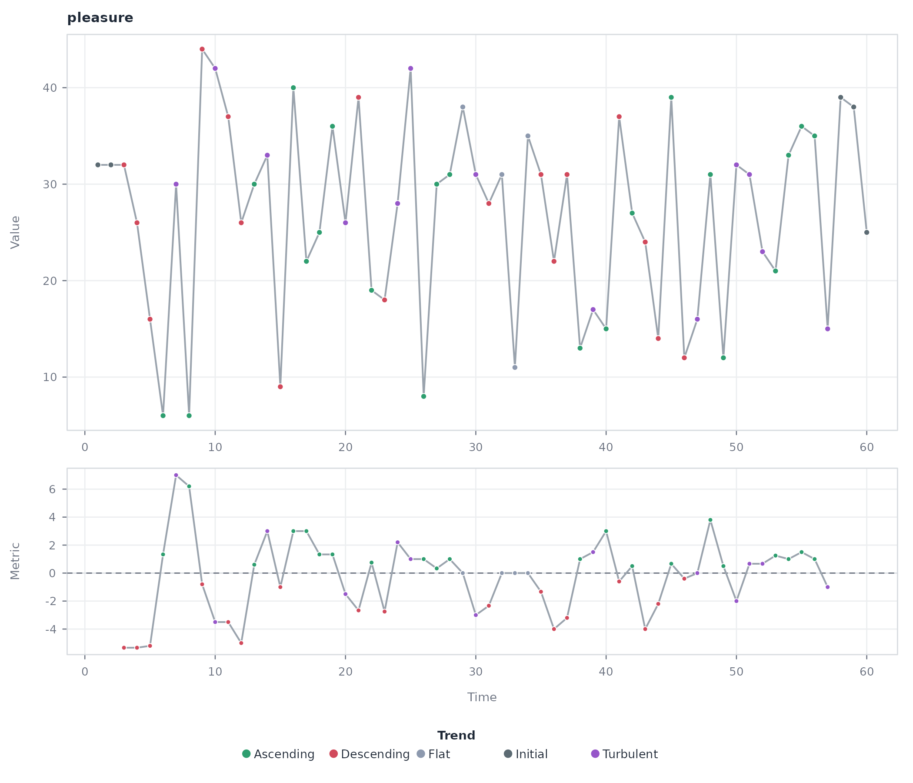

The lower panel displays the rolling metric used to assign direction.
This is the appropriate diagnostic view for evaluating crossings of the
flat band and their correspondence with the measured series.

## Constructed-network plots

Objects returned by
[`tsn()`](https://pak.dynasite.org/tsn/reference/tsn.md) and
[`vg()`](https://pak.dynasite.org/tsn/reference/vg.md) provide two plot
types.

| `type` | Graphical encoding | Scientific use |
|----|----|----|
| `"network"` | Nodes and edges of the constructed network | Examining relational structure, central observations, and connectivity |
| `"series"` | Measurements retained in the network object | Verifying the temporal data from which the network was constructed |

For `type = "network"`, graphical arguments are passed to
[`cograph::splot()`](https://sonsoles.me/cograph/reference/splot.html).
Important options include `layout`, `labels`, `node_size`, `node_fill`,
`edge_color`, and edge-label controls. The tsn defaults use a spring
layout, degree-based node sizing, and unobtrusive edge styling. For
`type = "series"`, arguments such as `overlay`, `points`, `trend`,
`legend`, and `grid` modify the temporal view.

### Network

A horizontal visibility graph is constructed and immediately plotted.
The default type is `"network"`.

``` r

visibility <- vg(
  data = short,
  type = "horizontal",
  series = "pleasure"
)

plot(visibility)
```

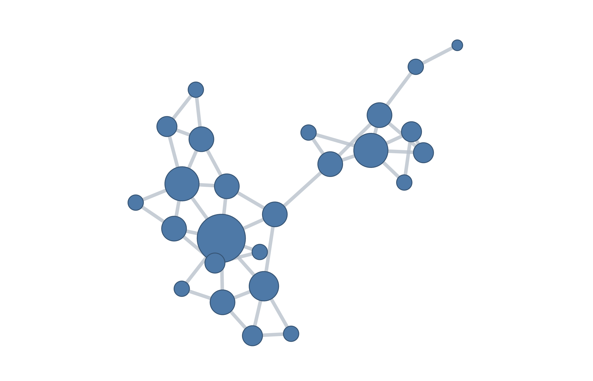

Nodes represent observations and edges represent horizontal visibility.
The network view removes the explicit time axis and emphasizes which
observations remain mutually visible across intervening values.

### Source series

``` r

visibility <- vg(
  data = short,
  type = "horizontal",
  series = "pleasure"
)

plot(visibility, "series")
```

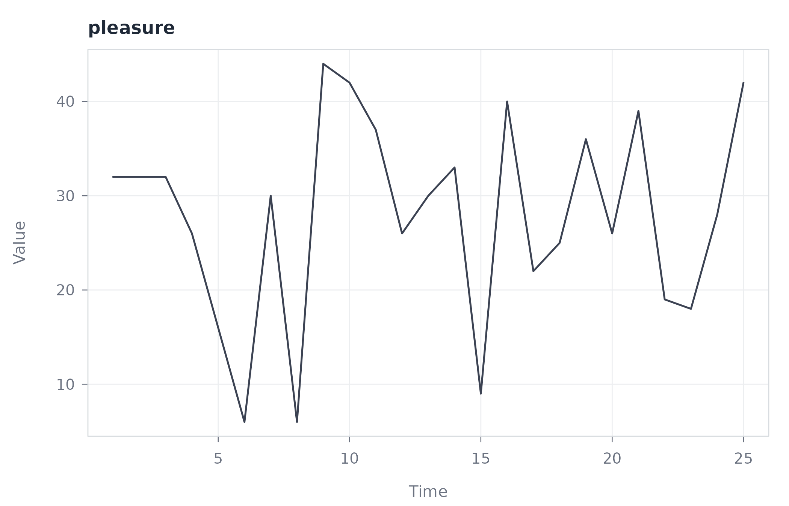

The source-series view restores magnitude and temporal order. It is a
diagnostic complement to the network rather than an alternative network
model.

## Transition Network Analysis plots

The TNA family comprises models returned by
[`ts_tna()`](https://pak.dynasite.org/tsn/reference/ts_tna.md),
[`ts_ftna()`](https://pak.dynasite.org/tsn/reference/ts_tna.md),
[`ts_cna()`](https://pak.dynasite.org/tsn/reference/ts_tna.md), and
[`ts_atna()`](https://pak.dynasite.org/tsn/reference/ts_tna.md). Each
model supports the same three plot types.

| `type` | Graphical encoding | Scientific use |
|----|----|----|
| `"combined"` | Source sequence and transition network in one figure | Connecting temporal state membership to estimated state relationships |
| `"network"` | Transition network only | Examining edge weights, direction, and persistence |
| `"series"` | State-classified source sequence only | Inspecting the sequence used to estimate transition relationships |

The `type` argument selects the overall representation. Within the
combined view, `network_width` controls the relative width of the
network panel. `overlay` and `ribbon` determine how states are displayed
with the source series, while `points`, `alpha`, and `palette` control
its appearance. Network encoding is modified with `node_size`,
`node_scale`, and `show_weights`. Arguments not consumed by the tsn
method are passed to
[`cograph::splot()`](https://sonsoles.me/cograph/reference/splot.html).

The `network` argument selects a per-series or summary network. These
coincide for the single source series used here. The distinction becomes
relevant only when a model contains more than one source sequence.

### Combined

The state sequence is converted to a Transition Network and immediately
plotted. The combined representation is the default.

``` r

probabilities <- ts_tna(states)

plot(probabilities)
```

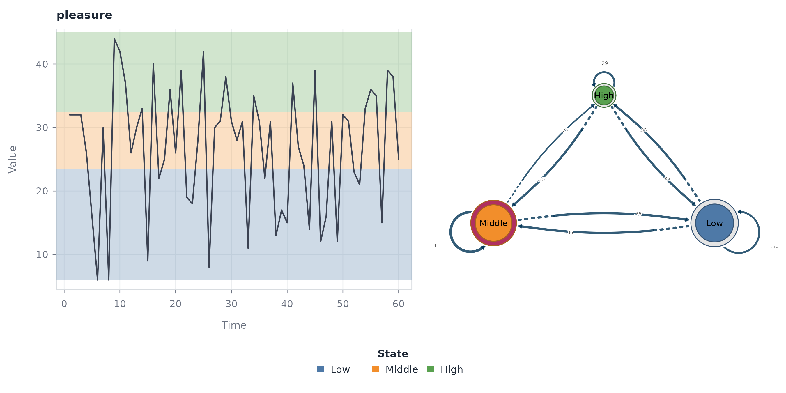

The temporal panel preserves the observations and their assigned states.
The network panel represents states as nodes and conditional transition
probabilities as directed edges. Their juxtaposition makes the
derivation of the relational structure explicit.

### Network

``` r

probabilities <- ts_tna(states)

plot(probabilities, "network")
```

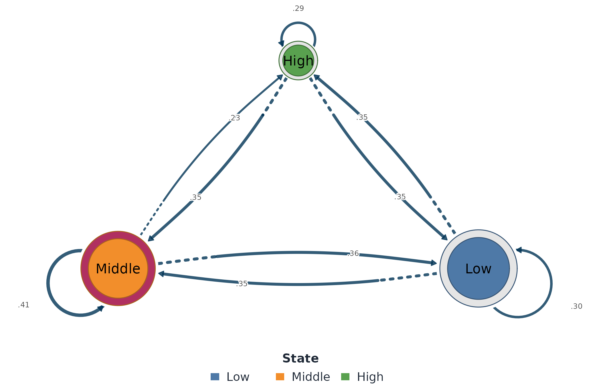

The network-only view allocates the full plotting region to the
relational structure. Directed edges encode conditional transition
probabilities and self-loops encode persistence.

### Source series

``` r

probabilities <- ts_tna(states)

plot(probabilities, "series")
```

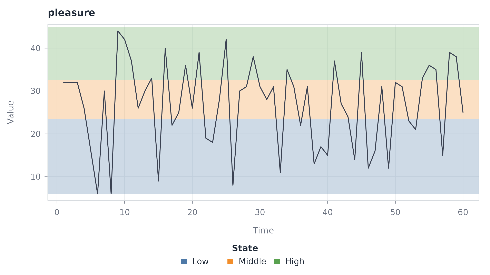

The series-only view retains the state classification but suppresses the
network. It is used to inspect the sequence from which transition
weights were estimated.

## Extracted-model plots

[`series_networks()`](https://pak.dynasite.org/tsn/reference/series_networks.md)
creates an indexed collection of source-specific network models. Its
`series` argument selects a model when the collection contains more than
one source. With the single series used here, no selection argument is
required. The model is extracted and plotted in the same code block.

``` r

probabilities <- ts_tna(states)
individual <- series_networks(probabilities)

plot(individual)
```

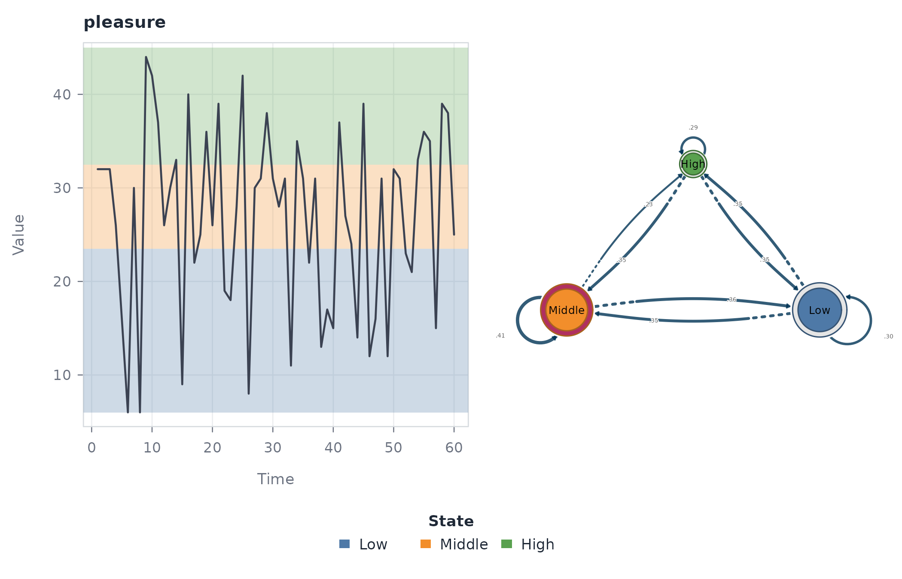

The plot uses the TNA network representation and retains the provenance
stored by
[`series_networks()`](https://pak.dynasite.org/tsn/reference/series_networks.md).

## Selecting a plot

The plot type should follow the scientific question rather than the
desired appearance alone.

| Scientific question | Recommended view |
|----|----|
| When do discrete states or local directions occur? | State overlay, ribbon, or trend points |
| How was a classification produced? | Trend panels or a stacked state view |
| What temporal sequence generated the network? | Source-series view |
| What relationships define the constructed network? | Network view |
| How does a state sequence relate to its transition structure? | Combined TNA view |

Arguments controlling colour, size, labels, and layout change the
graphical encoding but do not change the fitted object. Consequently,
interpretive claims should follow the construction method and edge
definition stored in the model, not the visual prominence created by a
particular style option.
